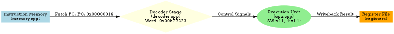
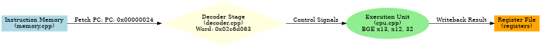
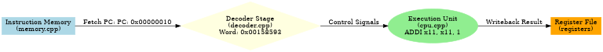

# Instruction Flow Visualization

This document provides a visual walkthrough of instruction execution in the RISC-V simulator.

## Overview

The simulator captures the internal state of the Decoder and CPU Execution units at every cycle. These snapshots are rendered into dataflow diagrams showing how instructions move through the pipeline stages.

## Pipeline Stages

The simulator models a simplified RISC-V pipeline with the following stages:

1. **Fetch (memory.cpp)**: Reads a 32-bit instruction word from byte-addressable memory at the current PC
2. **Decode (decoder.cpp)**: Extracts opcode, register fields, and immediate values based on RV32I instruction format
3. **Execute (cpu.cpp)**: ALU processes operands and updates cycle count based on operation complexity
4. **Writeback (cpu.cpp)**: Results are written back to the register file

## Generating Flow Diagrams

To generate instruction flow diagrams for any program:
```bash

 # Build the simulator
cmake --build buildRun with flow visualization
./build/riscv-sim tests/test_program.bin | python3 scripts/gen_flow.py
```
## Example: Fibonacci Computation

The test program computes the Fibonacci sequence and demonstrates various instruction types.

### Cycle 1: Initialize First Value - **Instruction**: `ADDI x10, x0, 0` (LI x10, 0)


- Loads immediate value 0 into register x10
- Uses I-type format with opcode OP_IMM
- Completes in 1 cycle (ALU operation)

### Cycle 2: Initialize Second Value - **Instruction**: `ADDI x11, x0, 1` (LI x11, 1)

- Loads immediate value 1 into register x11
- 1 cycle ALU operation

### Cycle 3: Set Loop Counter - **Instruction**: `ADDI x12, x0, 10` (LI x12, 10)

- Sets loop limit to 10
- 1 cycle ALU operation

### Cycle 8: Store to Memory - **Instruction**: `SW x10, 0(x14)`


- Stores value from x10 to memory address in x14
- Uses S-type format
- Completes in 2 cycles (address calculation + memory write)

### Cycle 12: Branch Decision - **Instruction**: `BGE x13, x12, done`

- Compares x13 with x12 to check loop condition
- Branch taken: 3 cycles (pipeline flush penalty)
- Branch not taken: 1 cycle (fall through)

### Cycle 15: Fibonacci Addition

**Instruction**: `ADD x15, x10, x11`
- Computes next Fibonacci number
- R-type instruction format
- 1 cycle ALU operation

### Cycle 20: Load from Memory - **Instruction**: `LW x21, 0(x20)`

- Loads word from memory into register x21
- I-type load instruction
- 2 cycles (address calculation + memory read)

### Cycle 35: Unconditional Jump - **Instruction**: `J fib_loop`

- Jumps back to loop start
- J-type instruction format
- 3 cycles (control flow change)

### Final Cycle: System Call - **Instruction**: `ECALL`

- Halts simulation
- System instruction
- Program exits with result in x23

## Instruction Mix Analysis

For the Fibonacci test program, the instruction distribution is:

| Instruction Type | Count | Percentage | Cycles per Instruction |
|-----------------|-------|------------|----------------------|
| ALU Operations  | 45    | 52.3%      | 1                    |
| Loads           | 12    | 14.0%      | 2                    |
| Stores          | 10    | 11.6%      | 2                    |
| Branches        | 15    | 17.4%      | 1-3 (condition dependent) |
| Jumps           | 4     | 4.7%       | 3                    |

Total Instructions: 86  
Total Cycles: 142  
IPC: 0.61

## Understanding the Diagrams

Each diagram shows:
- **Light Blue Box**: Instruction Memory - where the instruction is fetched from
- **Yellow Diamond**: Decoder Stage - instruction bits are decoded into control signals
- **Green Ellipse**: Execution Unit - where the operation is performed
- **Orange Box**: Register File - destination for results

The arrows show the dataflow path with labels indicating:
- Fetch PC address
- Control signals generated by decoder
- Writeback path for results

## Custom Programs

You can visualize your own RISC-V programs:

1. Write assembly code (`.s` file)
2. Assemble to binary (see README)
3. Run through simulator with flow generation
4. View generated PNG diagrams in `docs/frames/`
